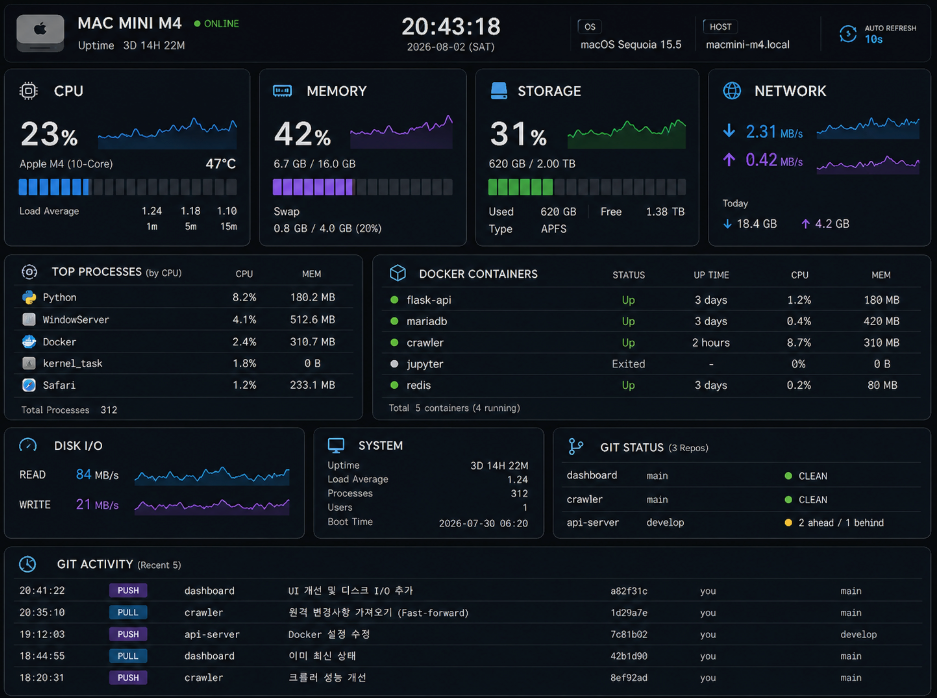

## Mac mini M4 Dashboard v3
- Flask Dashboard for Mac



### 사용법
- 설치:
```bash
python3 -m venv .venv
source .venv/bin/activate
pip install -r requirements.txt
```


- 실행:
```bash
python app.py
```

### Ex
- iPad에서 Safari:
```bash
ipconfig getifaddr en0
http://MAC_MINI_IP:8080
```

### git 저장소 추가
- Git 저장소:
app.py 상단 GIT_REPOS에 경로를 추가하세요.

```
예:
GIT_REPOS = [
 {"name":"dashboard","path":"/Users/username/projects/dashboard"},
 {"name":"crawler","path":"/Users/username/projects/crawler"},
]
```

```
Git Activity:
~/macmini-dashboard-git.log 를 읽습니다.
형식:
시간|PUSH|repo|branch|commit|message
```

#### Git 자체의 git log만으로는 실제 push/pull 시각을 정확히 알 수 없으므로, 정확한 이벤트 기록은 다음 단계에서 wrapper로 연결할 수 있습니다.
